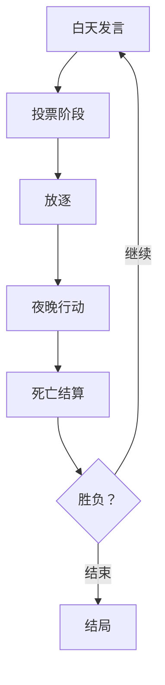

# 大明暗夜录
**AI 驱动的历史狼人杀 · 明末权谋 · 4大史诗结局**

> **「天启七年，魏忠贤专权，皇太极虎视，闯王揭竿……」**  
> 11位历史人物，11个真实身份，1场AI驱动的朝堂暗杀。  
> **忠臣肃清奸佞？还是大顺称帝？大清入关？阉党再起？**

---

## 游戏特色

| 功能 | 说明 |
|------|------|
| **真实历史人物** | 袁崇焕、魏忠贤、皇太极、李自成、杨涟等11位明末风云人物 |
| **4大史诗结局** | 明廷中兴 / 大顺称帝 / 大清建立 / 魏忠贤专权 |
| **AI角色扮演** | 每人由独立LLM Agent驱动，发言符合历史性格 |
| **完整狼人杀机制** | 预言家查验、狼人刀人、女巫毒药、投票放逐 |
| **LangGraph 状态机** | 严谨流程：白天发言 → 投票 → 放逐 → 夜晚行动 → 死亡结算 |
| **增量打印输出** | 实时显示11人完整发言与投票 |

---

## 游戏流程

### 快速开始
# 1. 克隆项目
git clone https://github.com/yourname/ming-werewolf-agent.git
cd ming-werewolf-agent

# 2. 创建虚拟环境
conda create -n werewolf python=3.11
conda activate werewolf

# 3. 安装依赖
pip install -r requirements.txt

# 4. 设置API密钥（支持任意LLM）
export OPENAI_API_KEY="sk-xxx"

# 5. 运行游戏
python web_demo.py

# 6. 演示视频

https://github.com/user-attachments/assets/010fb7dd-d0c4-4a31-9522-46afb665fbbe

